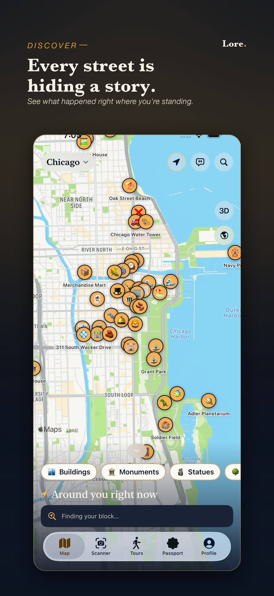
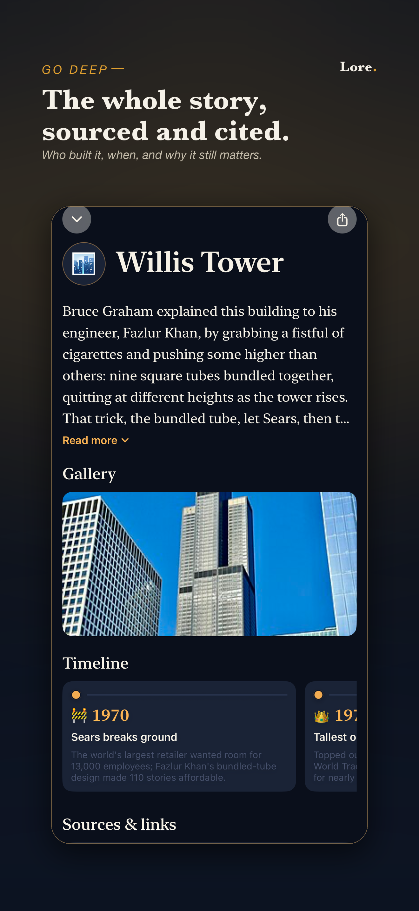
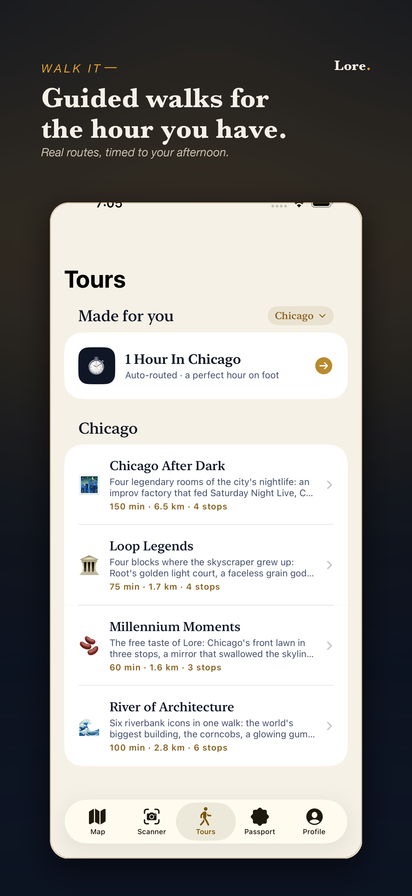
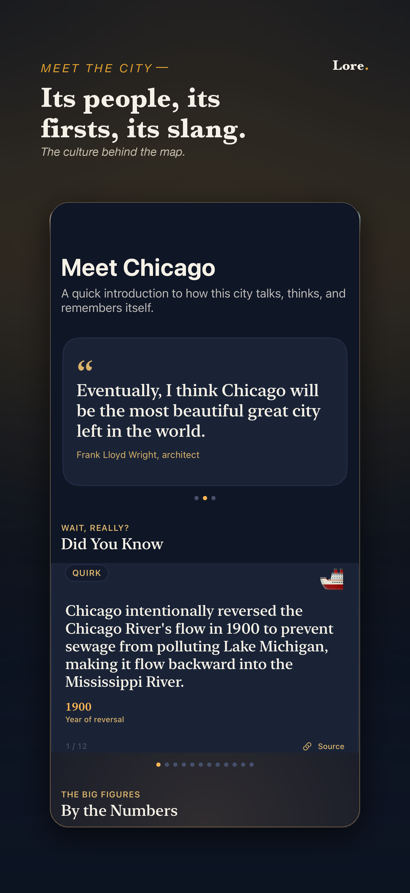
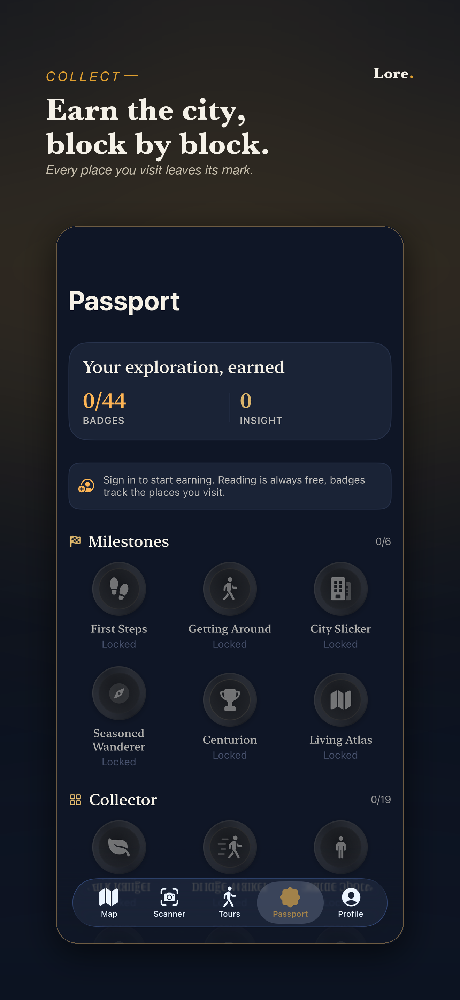
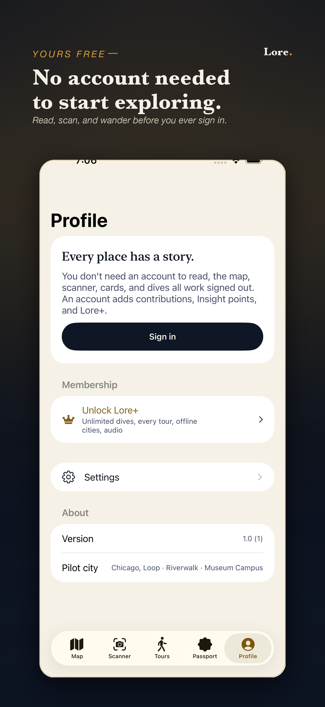
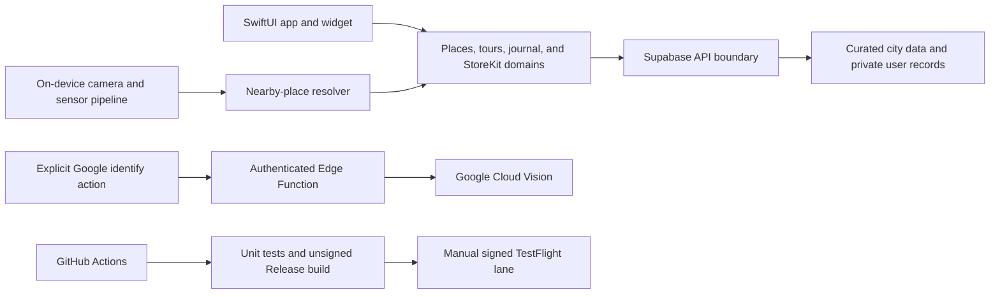

# Lore for iPhone

<p align="center"><strong>A native SwiftUI city guide for finding the stories hiding in the streets around you.</strong></p>

<p align="center">
  <a href="#product-tour">Product tour</a> |
  <a href="#architecture">Architecture</a> |
  <a href="#build-and-test">Build and test</a> |
  <a href="SECURITY.md">Security</a>
</p>

Lore is a curated city guide for iPhone. People can browse a living map, point the camera at chronicled places, read historical stories, follow walks, listen to narration, and keep a private visit journal. Coverage is curated city by city; Lore does not claim universal recognition or a source link for every catalog record.

**Stack:** Swift, SwiftUI, MapKit, MapLibre, StoreKit 2, Supabase, XcodeGen, Fastlane, and GitHub Actions.

## Product tour

<table>
  <tr>
    <td></td>
    <td></td>
    <td></td>
  </tr>
  <tr>
    <td></td>
    <td></td>
    <td></td>
  </tr>
</table>

## What ships

- A city map, city switcher, search, place cards, deep dives, and culture content
- A live camera scanner that ranks known nearby places using on-device Apple frameworks
- An explicit Google identification action for one user-confirmed frame
- Curated walking tours and an on-device tour Live Activity
- Passport, visits, private notes and photos, and achievements
- Keychain-backed authentication and secure password recovery
- In-app account deletion and StoreKit 2 purchases and restoration

Public contributions, background location, advertising, cross-app tracking, and unimplemented identity providers are deliberately excluded from the current release.

## Architecture



Normal scanning stays on-device. Lore does not store continuous camera video or continuous location history. The separate Google identification action requires authentication, disclosure, confirmation, a single current image, and server-side payload and quota enforcement.

## Repository map

| Path | Purpose |
| --- | --- |
| `Sources/Lore` | iPhone application source |
| `Sources/LoreWidget` | Widget and Live Activity extension |
| `Sources/LoreTests` | Unit and contract tests |
| `Sources/LoreUITests` | UI verification and screenshot automation |
| `supabase/functions` | Authenticated server operations included in this public lane |
| `fastlane` | Tests, signing, screenshots, preflight, and TestFlight delivery |
| `.github/workflows` | CI, screenshots, App Store preflight, and release automation |

## Build and test

Requirements: macOS, Xcode, XcodeGen, Ruby, and Bundler.

```sh
xcodegen generate
bundle install
bundle exec fastlane tests
```

The generated Xcode project is not the source of truth and should not be edited manually. `.github/workflows/ios-testflight.yml` runs tests and an unsigned Release compile for source changes. TestFlight upload remains an explicit manual dispatch.

Local syntax and privacy-manifest checks:

```sh
swiftc -parse $(git diff --name-only -- '*.swift')
plutil -lint Sources/Lore/PrivacyInfo.xcprivacy \
  Sources/LoreWidget/PrivacyInfo.xcprivacy
```

## Release state

- Marketing version: `1.0`
- Bundle ID: `com.erickdronski.lore`
- Minimum platform: iOS 17, iPhone only
- Delivery: tested native build through a manual TestFlight lane

The final release authority is a clean simulator test run plus a signed Release archive from the same commit uploaded to App Store Connect.

## Related repositories

App Store copy, legal pages, backend migrations, and public web/support routes live in separate private repositories. This repository is the public native shipping and TestFlight lane.

## Contributing, security, and license

Read [CONTRIBUTING.md](CONTRIBUTING.md) before proposing a change. Report vulnerabilities privately using [SECURITY.md](SECURITY.md). Copyright 2026 Erick Dronski; see [LICENSE](LICENSE) for the source-available terms.
