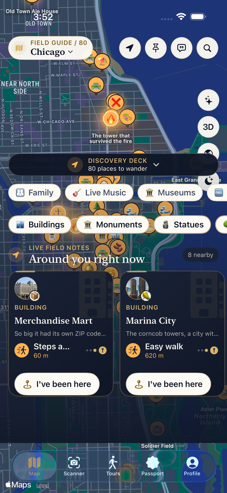
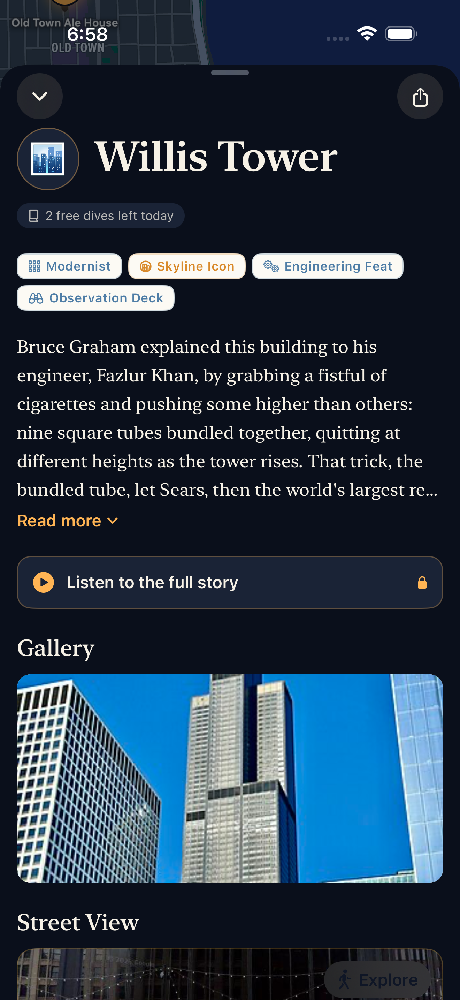
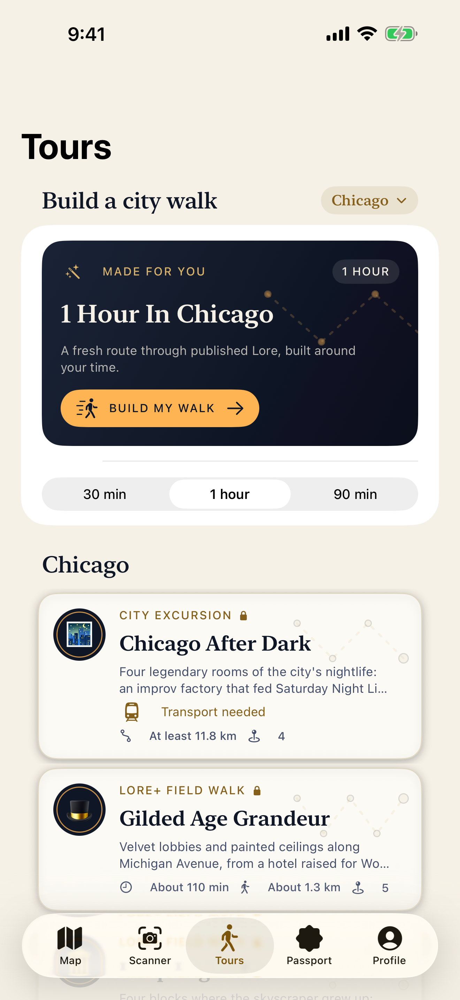
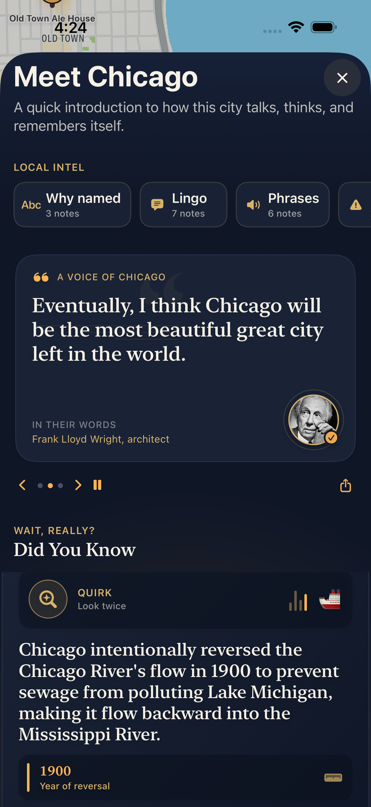
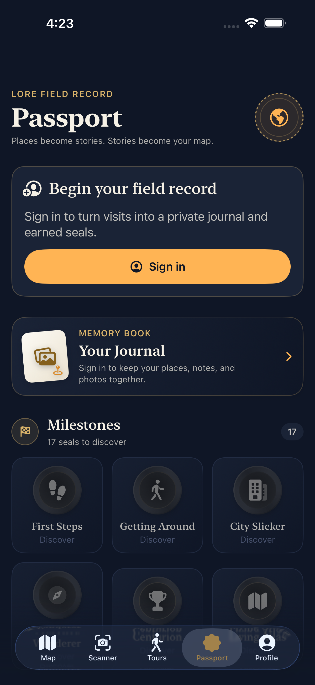
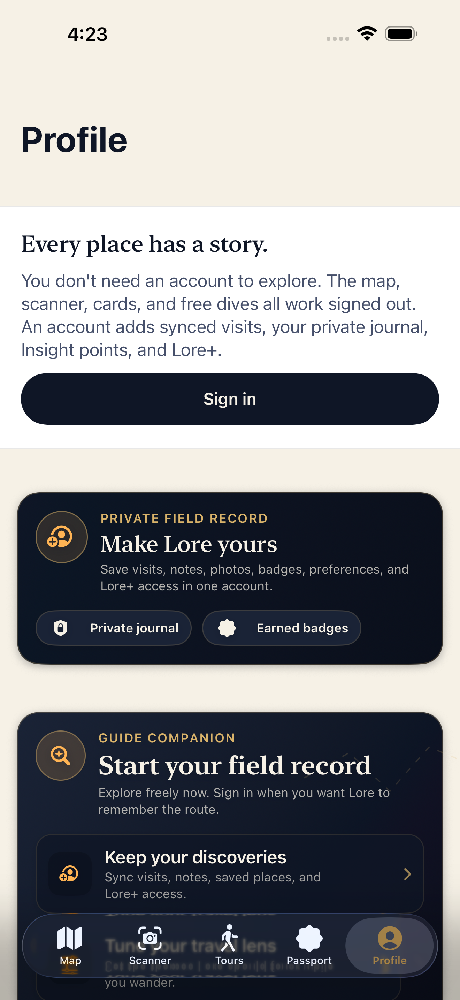
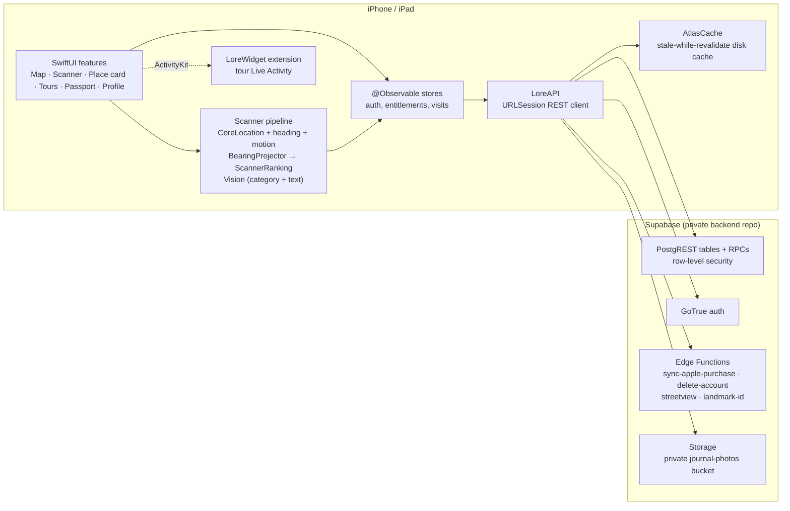

# Lore for iPhone and iPad

[](https://apps.apple.com/us/app/lore-ar-city-history-guide/id6788171860)


Lore is a native SwiftUI city-history guide. Raise the camera on a street and
Lore ranks the catalog places around you by direction and distance, entirely on
the device, then opens a sourced story, timeline, gallery and narration for the
one you pick. Browse the map from home, follow self-guided walks, and keep a
private visit journal.

**Status:** version 1.2 is [live on the App Store](https://apps.apple.com/us/app/lore-ar-city-history-guide/id6788171860)
(released September 5, 2026). Build 48 was archived, signed and uploaded to
TestFlight by this repository's manual release lane from commit
[`261d633`](https://github.com/erickdronski/lore-ios/commit/261d633d277a9940b849b108df0f10776e657f76).
`main` carries post-release fixes that have not shipped yet.

## Screenshots

Unedited simulator captures of the shipped 1.2 build. Provenance (source SHA,
device, Xcode and SHA-256 per frame) is recorded in
[`fastlane/promo_screenshots`](fastlane/promo_screenshots/README.md).

<table>
  <tr>
    <td></td>
    <td></td>
    <td></td>
  </tr>
  <tr>
    <td></td>
    <td></td>
    <td></td>
  </tr>
</table>

## Features

- **Live scanner.** Camera, precise location, compass heading and device pitch
  rank nearby catalog places, with an explicit confidence tier (locked pin,
  bearing chip or directional hint) instead of a confident wrong answer.
  On-device Vision adds scene categories and legible signage text.
- **Map and Discovery Deck.** MapKit city map, category filters, city switcher,
  search, and an "Around you right now" rail of nearby places.
- **Place cards and deep dives.** Facts, stories, timelines, galleries, source
  links, Street View and Look Around, plus studio narration with an on-device
  voice fallback.
- **Walking tours.** Curated routes with per-stop stories, route notes and a
  tour Live Activity on the Lock Screen and Dynamic Island.
- **Passport and journal.** Visits, private notes and photos, milestones and
  shareable place cards.
- **Accounts and Lore+.** Email, Sign in with Apple, Google and Facebook
  (OAuth with PKCE); sessions in the Keychain; in-app account deletion. StoreKit
  2 subscriptions and lifetime purchase with server-side transaction
  verification and restore. Browsing never requires an account.
- **Universal app.** iPhone and iPad (sidebar layout, landscape), Dynamic Type
  and VoiceOver support, offline-tolerant content cache.

## Architecture


```mermaid
flowchart LR
    subgraph Device["iPhone / iPad"]
        UI["SwiftUI features<br/>Map · Scanner · Place card · Tours · Passport · Profile"]
        Stores["@Observable stores<br/>auth, entitlements, visits"]
        Scanner["Scanner pipeline<br/>CoreLocation + heading + motion<br/>BearingProjector → ScannerRanking<br/>Vision (category + text)"]
        API["LoreAPI<br/>URLSession REST client"]
        Cache["AtlasCache<br/>stale-while-revalidate disk cache"]
        Widget["LoreWidget extension<br/>tour Live Activity"]
    end
    subgraph Supabase["Supabase (private backend repo)"]
        REST["PostgREST tables + RPCs<br/>row-level security"]
        Auth["GoTrue auth"]
        Fn["Edge Functions<br/>sync-apple-purchase · delete-account<br/>streetview · landmark-id"]
        Storage["Storage<br/>private journal-photos bucket"]
    end
    UI --> Stores --> API
    UI --> Scanner
    Scanner --> Stores
    API --> Cache
    API --> REST & Auth & Fn & Storage
    UI -. ActivityKit .-> Widget
```

### App layers

| Layer | Path | Responsibility |
| --- | --- | --- |
| App shell | `Sources/Lore/App` | Entry point, routing, deep links (`lore://place/…`, `lore://tour/…`) |
| Features | `Sources/Lore/Features/*` | One folder per surface: `Map`, `Scanner`, `PlaceCard`, `Tours`, `Passport`, `Profile`, `Auth`, `Premium`, `Culture`, `Search`, `Share`, `Onboarding` |
| Models | `Sources/Lore/Models` | `Codable` value types mirroring the Supabase rows (`Place`, `Story`, `Dive`, `Tour`, `Visit`, `Entitlement`, …) |
| Networking | `Sources/Lore/Networking` | `LoreAPI` (hand-written PostgREST/Auth/Functions/Storage client), `AtlasCache`, `Config` |
| Design system | `Sources/Lore/DesignSystem` | Type scale, color, motion, reusable components |
| Shared | `Sources/Shared` | Types compiled into both the app and the widget extension |
| Widget | `Sources/LoreWidget` | WidgetKit/ActivityKit extension for the tour Live Activity |

### Geospatial pipeline

1. `LocationHeadingProvider` streams when-in-use location (10 m accuracy, 3 m
   distance filter), true heading (magnetic as a fallback) and camera pitch
   while the scanner is open,
   and requests temporary full accuracy only for that screen.
2. `BearingProjector` is pure great-circle math: bearing and distance from the
   device to each candidate place, and its angular offset from where the camera
   points.
3. `ScannerRanking` scores candidates on proximity, prominence, gaze, novelty
   and interest, then caps the confidence tier using horizontal and heading
   accuracy and pitch, so a noisy fix produces a hint rather than a pin.
   `DisambiguationStack` presents close calls as "one of these".
4. `VisionRecognitionService` classifies the frame and reads visible text on
   the device. It never claims a specific landmark identity from pixels.
5. `GeoScoutingService` probes ARKit geo-tracking coverage before offering the
   precise AR mode (`GeoARSessionController`).

Place catalogs are fetched per city, not per coordinate, so ranking needs no
location on the server. The ranking and projection code has no I/O and is
covered by unit tests (`ScannerLogicTests`, `VisionRecognitionTests`).

### Supabase boundary

- The app talks to Supabase through `LoreAPI`, a dependency-free `URLSession`
  client. Public catalog reads (`city`, `place_explore`, `story`, `dive`,
  `tour`, `city_culture`, deal feeds, `search_lore` RPC) use the publishable
  anon key; user rows (`visit`, `saved_place`, `user_prefs`, `entitlements`,
  `user_achievement`) require the signed-in user's token and are scoped by
  row-level security.
- The anon key in `Config.swift` is the publishable client key by design. No
  service-role key exists anywhere in this repository or its history.
- Privileged work runs in Edge Functions: `sync-apple-purchase` re-verifies
  StoreKit JWS transactions against Apple's chain before writing an
  entitlement, `delete-account` performs fenced account deletion, `streetview`
  keeps the Google Maps key server-side, and `landmark-id` serves the opt-in
  image match.
- Schema migrations and Edge Function source live in the private `lore`
  backend repository. `scripts/verify-edge-function-contracts.mjs` fails CI if
  deployable function code ever appears under `supabase/functions` here.
  `supabase/content` holds reviewed editorial seed payloads only.

## Privacy and location data

- **Location is when-in-use only.** There is no background location mode, no
  continuous location history and no region monitoring.
- **Precise coordinates are not sent to Lore's servers.** The scanner,
  Discovery Deck and tour guide use location on the device. Logging a visit
  sends only the place ID and its source, so the server records which catalog
  place a signed-in user marked, not where they were standing.
- **The live camera feed is never uploaded.** A frame leaves the device only
  when the user sends it: the opt-in Lore+ "Identify landmark" action requires
  sign-in, shows a disclosure and asks for confirmation before sending each
  single still frame, and scanner postcards go only where the user shares them
  through the system share sheet. Journal photos upload to a private storage
  bucket and are served through signed URLs.
- **No tracking.** No ad or analytics SDKs, and `NSPrivacyTracking` is false.
- The [privacy manifest](Sources/Lore/PrivacyInfo.xcprivacy) declares what is
  collected and why, and `PrivacyManifestTests` checks it against the shipping
  data flows. The public policy is at
  [lore-web-liart.vercel.app/privacy](https://lore-web-liart.vercel.app/privacy).

## Build and test

Requirements: macOS with Xcode 26.3 or newer, [XcodeGen](https://github.com/yonaskolb/XcodeGen),
and Ruby 3.3+ with Bundler for the Fastlane lanes (CI uses Ruby 3.4).
`Lore.xcodeproj` is generated from `project.yml` and is not committed.

```sh
brew install xcodegen
xcodegen generate

# Unit tests on a simulator (the scheme skips the StoreKit engine journeys)
xcodebuild test -project Lore.xcodeproj -scheme Lore \
  -destination 'platform=iOS Simulator,name=iPhone 17 Pro'

# StoreKit 2 purchase, restore, refund and expiry journeys (local StoreKitTest
# engine; CI runs this job on Xcode 26.3, and StoreKitTest activation depends on
# the local Xcode and simulator pairing)
xcodebuild test -project Lore.xcodeproj -scheme LoreStoreKitTests \
  -destination 'platform=iOS Simulator,name=iPhone 17 Pro' \
  CODE_SIGNING_ALLOWED=YES CODE_SIGN_IDENTITY=-

# The same unit-test gate CI runs, through Fastlane
bundle install
bundle exec fastlane tests

# Offline tests for the release tooling (no Apple credentials needed)
ruby fastlane/spec/lore_release_tooling_test.rb
```

The unit suite has 236 tests across scanner math, Vision parsing, networking
resilience, StoreKit entitlement logic, account flows, privacy-manifest
contracts and layout. The app runs against the production Supabase project
with the publishable key; no local backend is needed.

## CI and release pipeline

| Workflow | Trigger | What it does |
| --- | --- | --- |
| [iOS CI and TestFlight](.github/workflows/ios-testflight.yml) | Pull request, push to `main`, manual | Unit tests, unsigned Release compile with version/device-family checks, StoreKit journeys. The signed TestFlight job runs only on a manual dispatch from `main` with `upload_to_testflight` set, after that run's test jobs pass. |
| [Release Tooling Tests](.github/workflows/release-tooling-tests.yml) | Pull request, push to `main` | Offline Minitest suite for the release guards in `fastlane/lib`. |
| [App Store · Preflight / Submit](.github/workflows/app-store-preflight.yml) | Manual only | Read-only submission audit, or one explicit, version-pinned App Store Connect action (prepare, select build, submit, hold, swap, auto-release). |
| [App Store · Screenshots](.github/workflows/screenshots.yml) | Manual only | Captures screenshots on the simulator with `fastlane snapshot`. No signing, no upload. |
| [App Store · Upload Screenshots](.github/workflows/screenshots-upload.yml) | Manual only | Uploads the committed screenshot set after proving it was captured from the named release commit. |

Release design:

- **Nothing ships from a push.** TestFlight uploads and every App Store
  Connect action are manual workflow dispatches. The TestFlight job waits for
  the same run's test jobs and refuses to run off `main`. App Store actions
  take an explicit marketing version (and build, where one applies) instead of
  "latest", and mutations fail closed unless the `APP_REVIEW_HOLD` variable
  allows them.
- **Signing** uses Fastlane Match with encrypted certificates and profiles in a
  private repository and an App Store Connect API key. Credentials live only in
  GitHub Actions secrets ([CI-SETUP.md](CI-SETUP.md)).
- **Build numbers** are one above the latest TestFlight build and never below
  the project floor, so reruns cannot collide.
- **Supply chain.** Every third-party action is pinned to a full commit SHA,
  and Dependabot is configured for both the actions and the Bundler lockfile.

The operator runbook is [TESTFLIGHT.md](TESTFLIGHT.md); the App Store guard
design is in [docs/APP-STORE-RELEASE-TOOLING.md](docs/APP-STORE-RELEASE-TOOLING.md).

## Repository map

| Path | Purpose |
| --- | --- |
| `Sources/Lore` | Application source |
| `Sources/LoreWidget`, `Sources/Shared` | Widget/Live Activity extension and shared types |
| `Sources/LoreTests` | Unit, contract and StoreKit journey tests |
| `Sources/LoreUITests` | Screenshot capture and adaptive-layout UI checks |
| `StoreKit/Lore.storekit` | Local StoreKit configuration for simulator purchases and tests |
| `fastlane` | Test, screenshot, signing, TestFlight and App Store Connect lanes; release guards and their tests |
| `supabase/content` | Reviewed editorial seed payloads (no deployable functions) |
| `tools` | Content compilers, source-health checks, coverage audit and narration rendering |
| `docs` | Engineering standards, release tooling notes and working logs |
| `project.yml` | XcodeGen spec: targets, schemes, Info.plist keys, versions |

## Contributing, security and license

Read [CONTRIBUTING.md](CONTRIBUTING.md) before opening a pull request, and
report vulnerabilities privately through [SECURITY.md](SECURITY.md).

The source is published for evaluation and review, not as open source.
Copyright 2026 Erick Dronski, all rights reserved: no permission is granted to
copy, modify or redistribute it without written consent. See [LICENSE](LICENSE).
